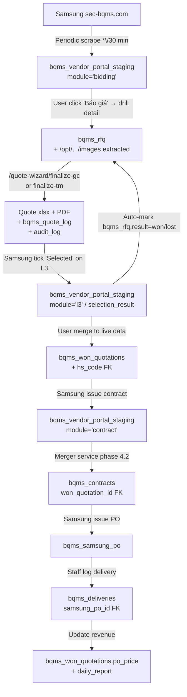

# BQMS End-to-End Flow & DB Mapping (2026-05-12)

> Tài liệu này mô tả luồng dữ liệu từ lúc Samsung gửi RFQ cho đến khi Song Châu giao hàng, kèm bảng mapping FK giữa các table. Mục đích: Thang + nhân viên hiểu rõ data đi từ đâu sang đâu, và developer biết JOIN bằng key gì.

## 1. Workflow Diagram



## 2. Bảng DB ↔ Module mapping

| Bước | Bảng | Field key | Liên kết tới | Module Frontend |
|------|------|-----------|--------------|-----------------|
| Scrape RFQ list | `bqms_vendor_portal_staging` | `rfq_number`, `module='bidding'` | bqms_rfq qua text match | `/bqms` (pending pane) |
| Drilled RFQ | `bqms_rfq` | `(rfq_number, bqms_code)` unique | staging via rfq_number; user via assigned_to | `/bqms` (main table) |
| Quote log | `bqms_quote_log` | `rfq_id` FK | bqms_rfq | `/dashboard` (daily report) |
| Quote audit | `audit_log` | `action='bqms.quote.*'` | record_id = `"{rfq_number}:{bqms_code}"` | `/dashboard` |
| Selection Result | `bqms_won_quotations` | `(rfq_number, bqms_code)` | match bqms_rfq via text | `/bqms/won-quotations` |
| HS code | `hs_codes` | `id` | `bqms_won_quotations.hs_code_id` | inline edit |
| Contract | `bqms_contracts` (NEW Phase 4.2) | `won_quotation_id` FK | bqms_won_quotations | `/bqms/won-quotations` (Contract col) |
| Samsung PO | `bqms_samsung_po` | `po_number` unique | text match bqms_rfq.rfq_number | `/bqms/mro` (NEW) |
| Delivery | `bqms_deliveries` | `samsung_po_id` FK | bqms_samsung_po | `/bqms/deliveries` |

## 3. Quy tắc tuân thủ (Thang 2026-05-12)

### V1 → V2 → V3 round bump
- Samsung tăng "RFQ No / 2 th" → scraper detect via regex `_VERSION_RE`
- **CHỈ** update `bqms_rfq.version` từ 1 → 2 (KHÔNG đụng quoted_price, supplier, notes về cũ)
- Trigger `dispatch_rfq_version_bump()` → notification cho user trong `assigned_to` (fallback by `person_in_charge_name` matching `users.full_name`)
- Code path: `backend/app/etl/bqms_bidding_scraper.py:_upsert_bqms_rfq` line ~750

### Image preservation
- Sau khi báo giá, Samsung xoá attachments. Re-scrape sẽ tìm thấy folder trống.
- Guard ở `bqms_bidding_scraper.py:1314` `preserve_mode = len(existing_images) > 0` → skip extraction
- Log: `PRESERVE images: {folder} already has N image(s) — skipping re-scrape`

### Closed / Skip status
- Closed: Samsung đóng RFQ sau D-Day → periodic scrape detect `progressStatusName ILIKE '%closed%'` → set `bqms_rfq.result='closed'`
- Skip: user click "Skip" button → set `bqms_rfq.result='skipped'` + staging `status='skipped'`
- Cả 2 hiển thị trong BQMS table khi user click filter pill "Closed" / "Skip"

### Người PT (assignee tracking)
- Cột "Người PT" trên `/bqms` table ưu tiên `users.full_name` JOIN qua `bqms_rfq.assigned_to`
- Khi user POST `/quote-wizard/finalize-gc` → `bqms_rfq.assigned_to = current_user.id` (COALESCE — không ghi đè nếu đã có)
- Fallback: `person_in_charge_name` (do scraper điền từ Samsung Procurement Manager)

## 4. Endpoints quan trọng

### BQMS core
- `GET /api/v1/bqms/rfq-table?year=&month=&result_filter=&page_size=` — main BQMS table
- `POST /api/v1/bqms/quote-wizard/finalize-gc` — submit GC quote (sets assigned_to + logs)
- `POST /api/v1/bqms/rfq/{id}/skip` body `{unskip?:bool}` — toggle skip
- `POST /api/v1/bqms/scrape-control/toggle?enabled=true` — bật/tắt cron 30p
- `POST /api/v1/bqms/hs-code/bulk-lookup` body `{codes:[]}` — tra HS hàng loạt

### OnlyOffice
- `GET /api/v1/onlyoffice/config?path=` — frontend fetch editor config
- `GET /api/v1/onlyoffice/file?token=` — sc-onlyoffice fetch file
- `POST /api/v1/onlyoffice/callback?token=` — save callback

### Daily report
- `GET /api/v1/daily-report/morning?report_date=YYYY-MM-DD` — Tổng quan dashboard data

### Notifications
- `GET /api/v1/notifications` — list cho current user
- `PUT /api/v1/notifications/{id}/read` — đánh dấu đã đọc

## 5. Phase 4.2: Contract dedicated table (TODO)

**Current state:** Contract scrape stages raw JSON vào `bqms_vendor_portal_staging WHERE module='contract'`. Không có FK với `bqms_won_quotations`.

**Phase 4.2 plan:**
```sql
CREATE TABLE bqms_contracts (
    id BIGSERIAL PRIMARY KEY,
    contract_no TEXT UNIQUE NOT NULL,
    won_quotation_id BIGINT REFERENCES bqms_won_quotations(id),
    rfq_number TEXT,
    bqms_code TEXT,
    contract_date DATE,
    total_amount NUMERIC(15, 4),
    signed_at TIMESTAMPTZ,
    status TEXT,
    raw_data JSONB,
    created_at TIMESTAMPTZ DEFAULT NOW(),
    updated_at TIMESTAMPTZ DEFAULT NOW()
);
```

Merger service `backend/app/services/bqms_contract_merger.py`:
1. Query staging where `module='contract' AND status='pending_review'`
2. Match by `rfq_number + bqms_code` → set won_quotation_id FK
3. Upsert into bqms_contracts
4. Mark staging.status='merged'

Frontend `/bqms/won-quotations` thêm column "Hợp đồng" với icon link → drawer hiện contract detail.

## 6. Performance notes

- Cron `*/30 * * * *` chạy `bqms_periodic_scrape` task trong sc-worker (procrastinate)
- DB key bật/tắt: `app_config.bqms_periodic_scrape_enabled` (jsonb boolean)
- Indices quan trọng đã có: `(rfq_number)`, `(bqms_code)`, `(result)`, `(inquiry_date)`, mới thêm `(assigned_to)`, `(department)`
