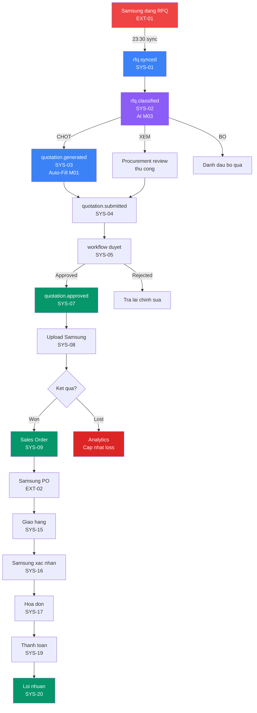
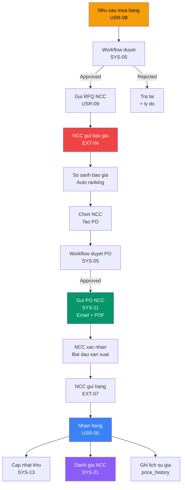
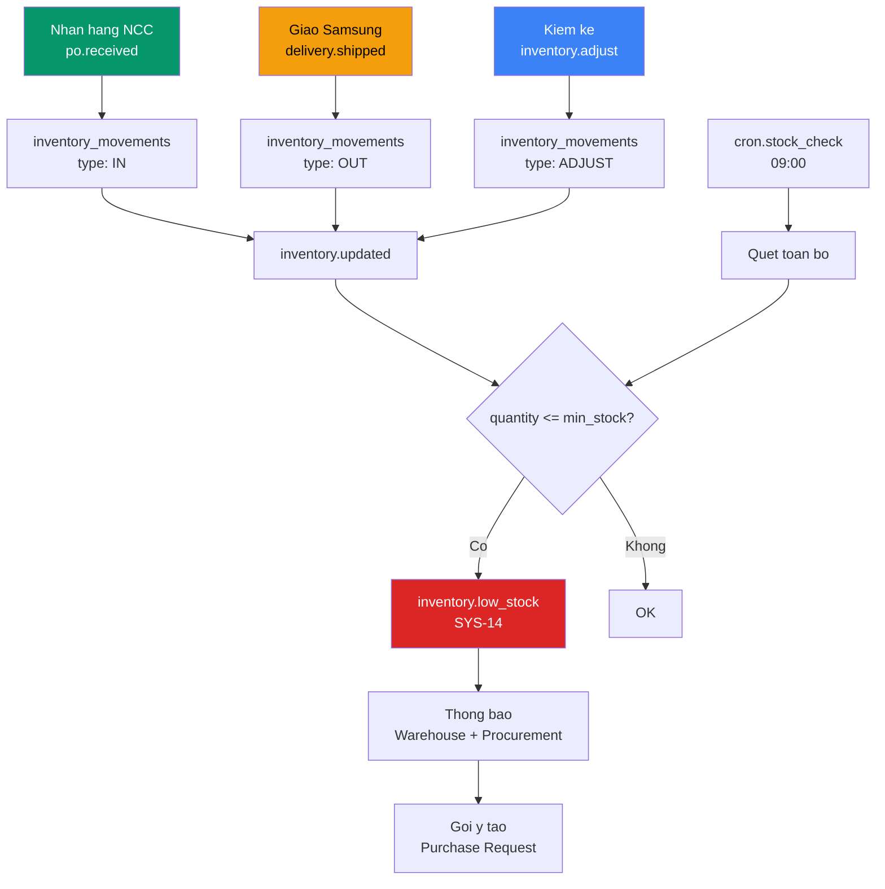
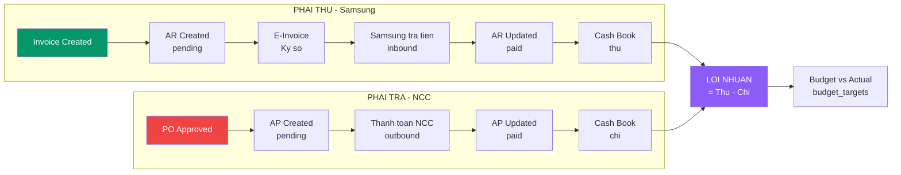
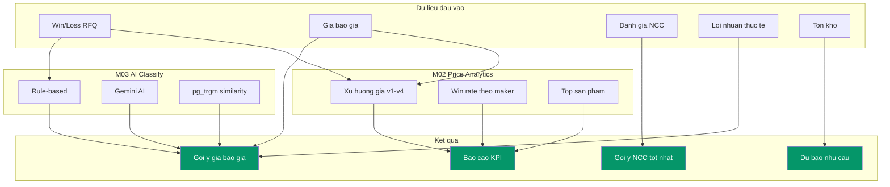
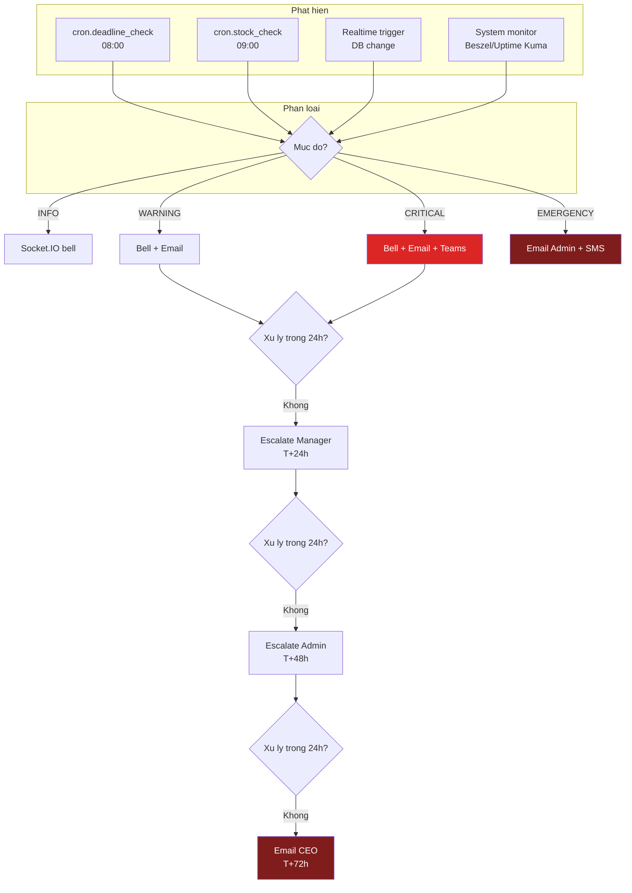
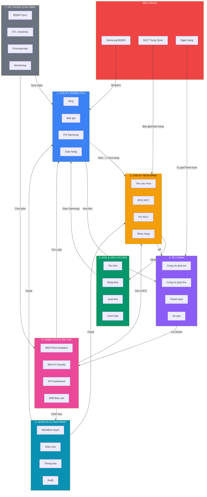

```mermaid
graph TD
    subgraph "Vong 1: AI Classify"
        A1["Win/Loss data"] --> A2["M02 Analytics"]
        A2 --> A3["M03 AI Training"]
        A3 --> A4["Phan loai chinh xac hon"]
        A4 -->|"More wins"| A1
    end

    subgraph "Vong 2: Pricing"
        B1["Deal margin thuc te"] --> B2["Phan tich gia"]
        B2 --> B3["Goi y gia M01"]
        B3 --> B4["Bao gia tot hon"]
        B4 -->|"Better margins"| B1
    end

    subgraph "Vong 3: Supplier"
        C1["Nhan hang data"] --> C2["Supplier rating"]
        C2 --> C3["Uu tien NCC tot"]
        C3 --> C4["Giao hang tot hon"]
        C4 -->|"More deliveries"| C1
    end

    subgraph "Vong 4: ETA"
        D1["Actual vs Expected"] --> D2["Delta analysis"]
        D2 --> D3["ETA adjusted"]
        D3 --> D4["Du bao chinh xac"]
        D4 -->|"More accurate"| D1
    end

    subgraph "Vong 5: Cash Flow"
        E1["Payment history"] --> E2["Pattern analysis"]
        E2 --> E3["Cash forecast"]
        E3 --> E4["Ke hoach thanh toan"]
        E4 -->|"Better timing"| E1
    end

    style A4 fill:#059669,color:#fff
    style B4 fill:#059669,color:#fff
    style C4 fill:#059669,color:#fff
    style D4 fill:#059669,color:#fff
    style E4 fill:#059669,color:#fff
```

# SONG CHAU ERP -- BAN DO SU KIEN TOAN HE THONG
## He Thong Than Kinh Cua Doanh Nghiep
### Phien ban: 1.0 | Ngay: 30/03/2026 | Tac gia: System Architect

---

> **Tai lieu nay cho thay TOAN BO cach he thong Song Chau van hanh tu dong.**
> Moi su kien la mot "tin hieu than kinh" -- khi mot viec xay ra, no tu dong kich hoat cac viec khac.
> Anh Thang chi can hieu: **Moi mui ten = mot viec tu dong xay ra, khong can ai lam tay.**

---

## MUC LUC

```
PHAN 1  -- TONG QUAN & CHU GIAI
PHAN 2  -- PHAN LOAI SU KIEN (4 NGUON)
PHAN 3  -- CHUOI DOANH THU (Revenue Chain)
PHAN 4  -- CHUOI MUA HANG (Procurement Chain)
PHAN 5  -- CHUOI KHO & VAN CHUYEN (Inventory & Logistics)
PHAN 6  -- CHUOI TAI CHINH (Finance Chain)
PHAN 7  -- CHUOI TRI TUE (Intelligence Chain)
PHAN 8  -- CHUOI CANH BAO (Alert & Escalation)
PHAN 9  -- VONG PHAN HOI (Feedback Loops)
PHAN 10 -- SO DO MERMAID TONG THE
PHAN 11 -- BANG THAM CHIEU DAY DU
```

---

# PHAN 1 -- TONG QUAN & CHU GIAI

## 1.1 He thong nay hoat dong nhu the nao?

```
Song Chau = Cong ty thuong mai: Mua phu tung tu Trung Quoc --> Ban cho Samsung Viet Nam

MOI NGAY, he thong tu dong:
  23:30  Dong bo du lieu tu Samsung BQMS (RFQ moi, PO moi)
  01:00  ETL dong bo du lieu tu OneDrive (Excel cu)
  06:00  Cap nhat ty gia VND/USD/RMB
  07:00  Gui bao cao buoi sang cho Manager + Admin
  08:00  Kiem tra deadline, canh bao qua han
  12:00  Lam moi dashboard (Materialized Views)

MOI KHI CO VIEC MOI:
  Samsung dang RFQ  --> He thong tu phan loai --> Dien bao gia --> Gui duyet --> Upload
  NCC gui bao gia   --> So sanh tu dong --> Goi y NCC tot nhat
  Hang ve kho       --> Cap nhat ton kho --> Canh bao neu thieu
  Thanh toan        --> Cap nhat cong no --> Tinh loi nhuan
```

## 1.2 Chu giai ky hieu

```
NGUON SU KIEN (4 mau):
  [BEN NGOAI]  -- Tu Samsung, NCC Trung Quoc, ngan hang, thi truong
  [DINH KY]    -- Cron job chay tu dong theo lich
  [HE THONG]   -- Tu dong kich hoat khi trang thai thay doi
  [NGUOI DUNG] -- Nhan vien thao tac tren he thong

VAI TRO:
  Admin       -- IT / CEO (Thang)
  Manager     -- Truong phong kinh doanh
  Procurement -- Nhan vien mua hang / BQMS
  Warehouse   -- Thu kho
  Staff       -- Nhan vien van phong
  Accountant  -- Ke toan (chi xem)

DINH DANG SU KIEN:
  doi_tuong.hanh_dong     Vi du: rfq.created, po.approved, inventory.low_stock

KY HIEU CHUOI:
  -->  Kich hoat truc tiep (dong bo)
  ==>  Kich hoat qua hang doi (bat dong bo, Procrastinate)
  -x>  Xu ly loi / fallback
```

---

# PHAN 2 -- PHAN LOAI SU KIEN (4 NGUON)

## 2.1 SU KIEN BEN NGOAI (External Events)

Cac su kien den tu ben ngoai he thong -- Song Chau khong kiem soat thoi diem.

### EXT-01: samsung.rfq_posted
```yaml
ten:         samsung.rfq_posted
nguon:       Samsung BQMS Portal
mo_ta:       Samsung dang yeu cau bao gia moi (RFQ) len portal
payload:
  - rfq_number: TEXT          # Ma RFQ Samsung
  - items: LIST               # Danh sach san pham can bao gia
  - deadline: DATE            # Han nop bao gia
  - buyer_info: OBJECT        # Thong tin nguoi mua Samsung
xu_ly:
  1. bqms_sync (Procrastinate) phat hien RFQ moi luc 23:30
  2. Luu vao bang bqms_rfq
  3. Kich hoat ==> rfq.synced
fallback:
  - Retry 3 lan voi exponential backoff (5s, 30s, 120s)
  - Sau 3 lan that bai: ghi etl_sync_log status='error'
  - Alert Admin qua Socket.IO + email
```

### EXT-02: samsung.po_issued
```yaml
ten:         samsung.po_issued
nguon:       Samsung BQMS Portal
mo_ta:       Samsung phat hanh PO (don dat hang) cho Song Chau
payload:
  - po_number: TEXT           # Ma PO Samsung
  - po_date: DATE
  - items: LIST               # San pham, so luong, gia
  - delivery_date: DATE       # Ngay giao hang yeu cau
  - buyer_email: TEXT
xu_ly:
  1. bqms_sync phat hien PO moi
  2. Luu vao bang bqms_samsung_po
  3. Lien ket voi bqms_rfq (neu co)
  4. Kich hoat ==> po.received_from_samsung
fallback:
  - Luu raw_data JSON goc de xu ly thu cong neu parse loi
  - Thong bao Procurement de kiem tra
```

### EXT-03: samsung.po_updated
```yaml
ten:         samsung.po_updated
nguon:       Samsung BQMS Portal
mo_ta:       Samsung cap nhat PO (thay doi so luong, ngay giao, huy)
payload:
  - po_number: TEXT
  - changes: OBJECT           # Truong thay doi
  - version: INT              # Phien ban moi
xu_ly:
  1. So sanh voi phien ban cu trong DB
  2. Cap nhat bqms_samsung_po, tang version
  3. Neu thay doi lon (huy, giam >20%) --> alert Manager
  4. Kich hoat ==> po.samsung_updated
fallback:
  - Giu phien ban cu, danh dau conflict de xu ly thu cong
```

### EXT-04: supplier.quote_received
```yaml
ten:         supplier.quote_received
nguon:       NCC Trung Quoc (qua email / WeChat)
mo_ta:       NCC gui bao gia phan hoi RFQ cua Song Chau
payload:
  - supplier_id: BIGINT
  - rfq_id: BIGINT
  - unit_price: NUMERIC
  - currency: TEXT (USD/RMB)
  - lead_time_days: INT
  - validity_date: DATE
xu_ly:
  1. Procurement nhap thu cong vao rfq_quotations
  2. He thong tu dong so sanh voi cac bao gia khac
  3. Kich hoat --> rfq.quote_compared
fallback:
  - Deadline 3 ngay, sau do he thong nhac Procurement theo doi
```

### EXT-05: bank.exchange_rate_updated
```yaml
ten:         bank.exchange_rate_updated
nguon:       API Vietcombank / BIDV (hoac nhap thu cong)
mo_ta:       Ty gia hoi doai thay doi hang ngay
payload:
  - rate_date: DATE
  - USD_VND: NUMERIC
  - RMB_VND: NUMERIC
  - rate_type: TEXT (cash_buy/transfer/sell)
xu_ly:
  1. Cap nhat bang exchange_rates
  2. Tinh lai amount_vnd cho cac PO dang mo
  3. Cap nhat deal_margins neu chenh lech >2%
  4. Kich hoat ==> exchange_rate.updated
fallback:
  - Dung ty gia ngay hom truoc
  - Alert ke toan neu khong cap nhat duoc 2 ngay lien
```

### EXT-06: bank.payment_received
```yaml
ten:         bank.payment_received
nguon:       Ngan hang (Samsung thanh toan)
mo_ta:       Nhan duoc thanh toan tu Samsung
payload:
  - amount: NUMERIC
  - currency: TEXT
  - bank_ref: TEXT
  - payer: TEXT
xu_ly:
  1. Ke toan / Procurement ghi nhan vao payment_transactions
  2. Cap nhat accounts_receivable (paid_amount, status)
  3. Neu paid du --> AR status = 'paid'
  4. Kich hoat --> payment.received_from_customer
fallback:
  - Ghi nhan giao dich, danh dau 'unmatched' neu khong map duoc voi AR
```

### EXT-07: supplier.shipment_notification
```yaml
ten:         supplier.shipment_notification
nguon:       NCC Trung Quoc (qua email / chat)
mo_ta:       NCC thong bao da gui hang
payload:
  - po_id: BIGINT
  - tracking_number: TEXT
  - estimated_arrival: DATE
  - shipped_qty: NUMERIC
xu_ly:
  1. Procurement cap nhat purchase_orders status='in_transit'
  2. Cap nhat tracking_number, expected_date
  3. Thong bao Warehouse ve ETA
  4. Kich hoat --> po.in_transit
fallback:
  - Neu khong co tracking --> tao task theo doi thu cong
```

---

## 2.2 SU KIEN DINH KY (Scheduled Events)

Cac cron job chay tu dong theo lich co dinh.

### SCH-01: cron.bqms_sync
```yaml
ten:         cron.bqms_sync
lich:        Moi ngay luc 23:30
mo_ta:       Dong bo du lieu tu Samsung BQMS (RFQ moi + PO moi/cap nhat)
thuc_hien:   Procrastinate scheduled task
xu_ly:
  1. Dang nhap Samsung BQMS (httpx + cookie session)
  2. Fetch danh sach RFQ moi --> luu bqms_rfq
  3. Fetch danh sach PO moi/cap nhat --> luu bqms_samsung_po
  4. Fetch trang thai giao hang --> cap nhat bqms_deliveries
  5. Ghi ket qua vao etl_sync_log
  6. Moi RFQ moi --> kich hoat ==> rfq.synced
  7. Moi PO moi --> kich hoat ==> po.received_from_samsung
su_kien_con:
  - rfq.synced (cho moi RFQ moi phat hien)
  - po.received_from_samsung (cho moi PO moi)
  - delivery.status_updated (neu trang thai giao hang doi)
fallback:
  - Login that bai: retry 3 lan, roi alert Admin
  - Parse loi: luu raw_data, danh dau error, alert
  - Timeout 5 phut: cancel va retry lan sau
```

### SCH-02: cron.etl_onedrive
```yaml
ten:         cron.etl_onedrive
lich:        Moi ngay luc 01:00
mo_ta:       Dong bo file Excel tu OneDrive (du lieu cu, lich su)
thuc_hien:   Procrastinate scheduled task
xu_ly:
  1. Ket noi Microsoft Graph API
  2. Dung delta token de lay file thay doi
  3. Doc Excel bang python-calamine (nhanh 9.4x)
  4. Import vao cac bang tuong ung (bqms_rfq, imv_inquiries, etc.)
  5. Cap nhat delta_token trong etl_sync_log
su_kien_con:
  - data.imported (cho moi batch import thanh cong)
fallback:
  - Token het han: thong bao Admin refresh token M365
  - File loi dinh dang: skip, ghi rows_skipped, alert
```

### SCH-03: cron.exchange_rate_fetch
```yaml
ten:         cron.exchange_rate_fetch
lich:        Moi ngay luc 06:00
mo_ta:       Lay ty gia moi nhat tu API ngan hang
thuc_hien:   Procrastinate scheduled task
xu_ly:
  1. Goi API Vietcombank / BIDV
  2. Parse ty gia USD/VND, RMB/VND, KRW/VND
  3. Luu vao exchange_rates
  4. Kich hoat ==> exchange_rate.updated
fallback:
  - API khong phan hoi: dung ty gia hom truoc
  - Ghi log va alert neu 2 ngay lien khong cap nhat
```

### SCH-04: cron.morning_report
```yaml
ten:         cron.morning_report
lich:        Moi ngay luc 07:00
mo_ta:       Gui bao cao buoi sang qua email cho tung vai tro
thuc_hien:   Procrastinate scheduled task
xu_ly:
  1. Truy van du lieu tu materialized views
  2. Tao Excel + PDF (openpyxl + WeasyPrint)
  3. Gui email qua Microsoft Graph API theo vai tro:
     - Admin: Tong quan toan he thong
     - Manager: KPI phong ban, phieu cho duyet
     - Procurement: RFQ moi, PO can xu ly
  4. Luu file vao filesystem, ghi report_executions
su_kien_con:
  - report.generated
  - report.email_sent
fallback:
  - Graph API loi: luu file, gui lai lan sau
  - Template loi: gui email text-only khem thong bao loi
```

### SCH-05: cron.deadline_check
```yaml
ten:         cron.deadline_check
lich:        Moi ngay luc 08:00
mo_ta:       Kiem tra deadline, canh bao qua han
thuc_hien:   Procrastinate scheduled task
xu_ly:
  1. Tim workflow_instances co deadline < NOW() + 24h
  2. Tim purchase_orders co expected_date < NOW() + 3 ngay
  3. Tim accounts_payable co due_date < NOW() + 7 ngay
  4. Tim bqms_rfq_submissions co deadline < NOW() + 12h
  5. Tao notification cho nguoi phu trach
  6. Gui email nhac nho
su_kien_con:
  - deadline.warning (con 24h-72h)
  - deadline.critical (qua han)
  - workflow.escalated (pending qua 3 ngay)
fallback:
  - Neu khong gui duoc thong bao: retry 3 lan
  - Ghi log moi deadline da kiem tra
```

### SCH-06: cron.weekly_report
```yaml
ten:         cron.weekly_report
lich:        Thu 2 hang tuan luc 07:00
mo_ta:       Bao cao tong hop tuan
xu_ly:
  - Tong hop PO tuan, win rate, doanh thu
  - So sanh voi tuan truoc (% tang/giam)
  - Gui Admin + Manager
```

### SCH-07: cron.monthly_report
```yaml
ten:         cron.monthly_report
lich:        Ngay 1 hang thang luc 07:00
mo_ta:       Bao cao tong hop thang (chi tiet nhat)
xu_ly:
  - Doanh thu, chi phi, loi nhuan thang
  - Top 5 NCC, Top 5 san pham
  - Win/loss rate BQMS
  - Hieu suat phe duyet
  - Xu huong gia NCC (so sanh 3 thang)
  - Gui Excel + PDF cho tat ca Manager + Admin
```

### SCH-08: cron.mv_refresh
```yaml
ten:         cron.mv_refresh
lich:        12:00 va 00:00 hang ngay
mo_ta:       Lam moi Materialized Views cho dashboard
xu_ly:
  1. REFRESH MATERIALIZED VIEW CONCURRENTLY mv_bqms_kpi
  2. REFRESH cac MV khac (7 views)
  3. Ghi ket qua vao mv_refresh_log
fallback:
  - Refresh loi: retry 1 lan, neu van loi thi alert
  - Ghi duration_ms de theo doi hieu suat
```

### SCH-09: cron.stock_check
```yaml
ten:         cron.stock_check
lich:        Moi ngay luc 09:00
mo_ta:       Kiem tra ton kho, canh bao muc thap
xu_ly:
  1. So sanh inventory.quantity voi min_stock
  2. Neu quantity <= min_stock --> tao stock_alert
  3. Thong bao Warehouse + Procurement
su_kien_con:
  - inventory.low_stock (cho tung san pham duoi nguong)
fallback:
  - Ghi log, khong lam gi neu khong co san pham duoi nguong
```

### SCH-10: cron.session_cleanup
```yaml
ten:         cron.session_cleanup
lich:        Moi ngay luc 03:00
mo_ta:       Don dep phien dang nhap het han
xu_ly:
  1. Xoa user_sessions co expires_at < NOW()
  2. Xoa Redis cache cho session da het
  3. Ghi audit_log so session da xoa
```

---

## 2.3 SU KIEN HE THONG (System Events)

Tu dong kich hoat khi trang thai du lieu thay doi.

### SYS-01: rfq.synced
```yaml
ten:         rfq.synced
nguon:       Sau khi cron.bqms_sync luu RFQ moi vao DB
payload:
  - rfq_id: BIGINT
  - rfq_number: TEXT
  - items_count: INT
  - deadline: DATE
xu_ly:
  1. ==> Chay M03 AI Smart Classify (rule-based + Gemini)
  2. --> Tao notification cho Procurement (bqms_rfq_new)
  3. --> Push Socket.IO realtime
  4. --> Ghi audit_log
su_kien_con:
  - rfq.classified (sau khi AI phan loai xong)
```

### SYS-02: rfq.classified
```yaml
ten:         rfq.classified
nguon:       Sau khi M03 AI phan loai xong
payload:
  - rfq_id: BIGINT
  - classification: TEXT (CHOT/XEM/BO)
  - confidence: FLOAT (0.0 - 1.0)
  - reasoning: TEXT
  - similar_history: LIST     # RFQ tuong tu trong qua khu
xu_ly:
  NEU classification = 'CHOT' (nen bao gia):
    1. ==> Chay M01 Auto-Fill Quotation tu dong
    2. --> Thong bao Procurement: "RFQ da phan loai CHOT, dang dien bao gia"
  NEU classification = 'XEM' (can xem xet):
    1. --> Thong bao Procurement de review thu cong
    2. --> Highlight tren dashboard
  NEU classification = 'BO' (bo qua):
    1. --> Danh dau bqms_rfq.result = 'cancelled'
    2. --> Ghi ly do vao notes
    3. --> Van hien thi de Procurement co the override
su_kien_con:
  - quotation.auto_fill_started (neu CHOT)
```

### SYS-03: quotation.generated
```yaml
ten:         quotation.generated
nguon:       M01 Auto-Fill hoan thanh
payload:
  - submission_id: BIGINT
  - rfq_number: TEXT
  - excel_cam_ket_path: TEXT
  - excel_commercial_path: TEXT
  - total_items: INT
  - suggested_prices: LIST
xu_ly:
  1. --> Thong bao Procurement review bao gia (30 giay)
  2. --> Hien thi preview tren UI
  3. Cho Procurement submit hoac chinh sua
su_kien_con:
  - quotation.submitted (khi Procurement submit)
```

### SYS-04: quotation.submitted
```yaml
ten:         quotation.submitted
nguon:       Procurement nhan submit bao gia
payload:
  - submission_id: BIGINT
  - submitted_by: UUID
xu_ly:
  1. --> Tao workflow_instance (type: bqms_quotation, status: pending_l1)
  2. --> Thong bao Manager de duyet
  3. --> Ghi audit_log
su_kien_con:
  - workflow.created
```

### SYS-05: workflow.created
```yaml
ten:         workflow.created
nguon:       Bat ky luc nao tao phieu duyet moi
payload:
  - workflow_id: BIGINT
  - workflow_type: TEXT
  - title: TEXT
  - amount: NUMERIC
  - assigned_to: UUID
  - deadline: TIMESTAMPTZ
xu_ly:
  1. --> Thong bao nguoi duyet (in-app + email + Teams)
  2. --> Push Socket.IO
  3. --> Bat dau dem deadline
  4. --> Ghi workflow_history (NULL -> draft -> pending_l1)
su_kien_con:
  - notification.sent
```

### SYS-06: workflow.status_changed
```yaml
ten:         workflow.status_changed
nguon:       PostgreSQL trigger notify_workflow_change()
payload:
  - workflow_id: BIGINT
  - old_status: TEXT
  - new_status: TEXT
  - actor_id: UUID
  - workflow_type: TEXT
xu_ly:
  NEU new_status = 'approved':
    --> Kich hoat hanh dong tuong ung theo workflow_type:
      bqms_quotation  --> quotation.approved
      po_approval     --> po.approved
      purchase_approval --> purchase_request.approved
      expense_approval --> expense.approved
  NEU new_status = 'rejected':
    --> Thong bao nguoi tao, ghi ly do
  NEU new_status = 'pending_l2':
    --> Escalate len Admin
  NEU new_status = 'cancelled':
    --> Dong phieu, thong bao tat ca stakeholders
su_kien_con:
  - quotation.approved / po.approved / etc.
  - notification.sent
  - audit_log.written
```

### SYS-07: quotation.approved
```yaml
ten:         quotation.approved
nguon:       workflow.status_changed (bqms_quotation -> approved)
payload:
  - submission_id: BIGINT
  - approved_by: UUID
xu_ly:
  1. Cap nhat bqms_rfq_submissions.status = 'submitted'
  2. ==> Upload bao gia len Samsung BQMS Portal (tu dong)
  3. --> Thong bao Procurement: "Bao gia da duyet, dang upload"
  4. --> Ghi audit_log
su_kien_con:
  - quotation.uploaded_to_samsung
```

### SYS-08: quotation.uploaded_to_samsung
```yaml
ten:         quotation.uploaded_to_samsung
nguon:       Task upload BQMS hoan thanh
payload:
  - submission_id: BIGINT
  - upload_status: TEXT (success/failed)
xu_ly:
  NEU success:
    1. --> Cap nhat status = 'submitted'
    2. --> Thong bao Procurement: "Da upload thanh cong"
    3. --> Bat dau theo doi ket qua (cho Samsung phan hoi)
  NEU failed:
    1. --> Retry 2 lan
    2. --> Thong bao Procurement upload thu cong
    3. --> Ghi loi vao etl_sync_log
```

### SYS-09: rfq.result_updated
```yaml
ten:         rfq.result_updated
nguon:       cron.bqms_sync phat hien ket qua RFQ (won/lost)
payload:
  - rfq_id: BIGINT
  - result: TEXT (won/lost)
  - po_number: TEXT (neu won)
  - po_price: NUMERIC
xu_ly:
  NEU result = 'won':
    1. --> Tao ban ghi bqms_won_quotations
    2. --> Cap nhat bqms_rfq.result = 'won'
    3. --> Thong bao Procurement + Manager: "TRUNG THAU!"
    4. ==> Tu dong tao Sales Order (sales_orders)
    5. --> Cap nhat M02 Price Analytics (win data)
    6. --> Feed back vao M03 AI (cai thien phan loai)
  NEU result = 'lost':
    1. --> Cap nhat bqms_rfq.result = 'lost'
    2. --> Thong bao Procurement
    3. --> Cap nhat M02 Price Analytics (loss data)
    4. --> Feed back vao M03 AI
su_kien_con:
  - sales_order.created (neu won)
  - analytics.win_loss_updated
  - ai.training_data_updated
```

### SYS-10: po.approved
```yaml
ten:         po.approved
nguon:       workflow.status_changed (po_approval -> approved)
payload:
  - po_id: BIGINT
  - po_number: TEXT
  - supplier_id: BIGINT
  - total_amount: NUMERIC
  - currency: TEXT
xu_ly:
  1. Cap nhat purchase_orders.status = 'approved'
  2. ==> Gui email PO cho NCC qua Graph API (PDF dinh kem)
  3. --> Tao accounts_payable (cong no phai tra)
  4. --> Ghi price_history cho tung line item
  5. --> Thong bao Procurement: "PO da gui cho NCC"
su_kien_con:
  - po.sent_to_supplier
  - finance.ap_created
  - price_history.recorded
```

### SYS-11: po.sent_to_supplier
```yaml
ten:         po.sent_to_supplier
nguon:       Sau khi gui email PO thanh cong
payload:
  - po_id: BIGINT
  - sent_at: TIMESTAMPTZ
  - email_message_id: TEXT
xu_ly:
  1. Cap nhat purchase_orders.status = 'sent_to_supplier'
  2. Cap nhat sent_to_supplier_at
  3. Bat dau countdown cho xac nhan NCC (deadline 3 ngay)
su_kien_con:
  - deadline.po_confirmation_pending
```

### SYS-12: po.received
```yaml
ten:         po.received
nguon:       Warehouse xac nhan nhan hang
payload:
  - po_id: BIGINT
  - received_items: LIST
    - product_id: BIGINT
    - received_qty: NUMERIC
    - quality_status: TEXT (ok/damaged/wrong)
xu_ly:
  1. Cap nhat purchase_orders.status = 'received' (hoac 'partial_received')
  2. --> Tao inventory_movements (type: 'in')
  3. --> Cap nhat inventory.quantity
  4. --> Tinh lai unit_cost (binh quan gia quyen)
  5. --> Thong bao Procurement: "Da nhan hang PO-XXXX"
  6. ==> Cap nhat supplier_ratings (delivery on-time, quality)
  7. --> Kiem tra neu co Sales Order lien quan --> chuan bi giao Samsung
su_kien_con:
  - inventory.updated
  - supplier.rating_updated
  - delivery.ready_to_ship (neu co SO cho hang)
```

### SYS-13: inventory.updated
```yaml
ten:         inventory.updated
nguon:       Bat ky thay doi ton kho (nhap/xuat/dieu chinh)
payload:
  - product_id: BIGINT
  - product_code: TEXT
  - old_qty: NUMERIC
  - new_qty: NUMERIC
  - movement_type: TEXT
xu_ly:
  1. Cap nhat inventory.quantity va available_qty
  2. Kiem tra: neu new_qty <= min_stock --> inventory.low_stock
  3. Ghi inventory_movements
  4. Invalidate Redis cache cho san pham nay
su_kien_con:
  - inventory.low_stock (neu duoi nguong)
```

### SYS-14: inventory.low_stock
```yaml
ten:         inventory.low_stock
nguon:       inventory.updated hoac cron.stock_check
payload:
  - product_id: BIGINT
  - product_code: TEXT
  - current_qty: NUMERIC
  - min_stock: NUMERIC
  - deficit: NUMERIC
xu_ly:
  1. --> Tao notification (stock_alert) cho Warehouse + Procurement
  2. --> Push Socket.IO realtime
  3. --> Hien thi canh bao tren dashboard
  4. --> Goi y tao Purchase Request
su_kien_con:
  - notification.sent
```

### SYS-15: delivery.shipped_to_samsung
```yaml
ten:         delivery.shipped_to_samsung
nguon:       Procurement cap nhat giao hang cho Samsung
payload:
  - delivery_id: BIGINT
  - samsung_po_id: BIGINT
  - shipped_qty: NUMERIC
  - delivery_date: DATE
xu_ly:
  1. Cap nhat bqms_deliveries.delivery_status = 'dang_giao'
  2. Tao inventory_movements (type: 'out')
  3. Cap nhat inventory.quantity (giam)
  4. Cap nhat bqms_samsung_po.process_status = 'shipped'
su_kien_con:
  - inventory.updated
```

### SYS-16: delivery.confirmed_by_samsung
```yaml
ten:         delivery.confirmed_by_samsung
nguon:       cron.bqms_sync phat hien Samsung xac nhan nhan hang
payload:
  - delivery_id: BIGINT
  - samsung_po_id: BIGINT
  - gr_qty: NUMERIC        # Goods Receipt quantity
xu_ly:
  1. Cap nhat bqms_deliveries.delivery_status = 'da_giao'
  2. Cap nhat bqms_samsung_po.received_at
  3. ==> Chuan bi xuat hoa don (invoice)
su_kien_con:
  - invoice.ready_to_create
```

### SYS-17: invoice.created
```yaml
ten:         invoice.created
nguon:       Procurement/Accountant tao hoa don
payload:
  - invoice_id: BIGINT
  - invoice_number: TEXT
  - customer_id: BIGINT
  - total_amount: NUMERIC
  - samsung_po_id: BIGINT
xu_ly:
  1. Luu vao revenue_invoices
  2. --> Tao accounts_receivable (cong no phai thu)
  3. --> Cap nhat bqms_samsung_po.process_status = 'invoiced'
  4. ==> Tao e_invoice (hoa don dien tu)
  5. --> Tinh deal_margin (loi nhuan thuc te)
su_kien_con:
  - finance.ar_created
  - e_invoice.created
  - margin.calculated
```

### SYS-18: payment.made_to_supplier
```yaml
ten:         payment.made_to_supplier
nguon:       Ghi nhan thanh toan cho NCC
payload:
  - transaction_id: BIGINT
  - ap_id: BIGINT
  - amount: NUMERIC
  - currency: TEXT
xu_ly:
  1. Tao payment_transactions (direction: outbound)
  2. Cap nhat accounts_payable.paid_amount
  3. Neu paid_amount >= amount --> AP status = 'paid'
  4. Cap nhat cash_book
su_kien_con:
  - finance.ap_updated
  - cash_book.entry_created
```

### SYS-19: payment.received_from_customer
```yaml
ten:         payment.received_from_customer
nguon:       Ghi nhan Samsung thanh toan
payload:
  - transaction_id: BIGINT
  - ar_id: BIGINT
  - amount: NUMERIC
xu_ly:
  1. Tao payment_transactions (direction: inbound)
  2. Cap nhat accounts_receivable.paid_amount
  3. Neu paid_amount >= amount --> AR status = 'paid'
  4. Cap nhat cash_book
  5. ==> Tinh lai deal_margin hoan chinh
su_kien_con:
  - finance.ar_updated
  - cash_book.entry_created
  - margin.finalized
```

### SYS-20: margin.calculated
```yaml
ten:         margin.calculated
nguon:       Sau khi co du thong tin doanh thu + chi phi
payload:
  - deal_id: TEXT
  - revenue: NUMERIC
  - total_cost: NUMERIC
  - margin_amount: NUMERIC
  - margin_pct: FLOAT
xu_ly:
  1. Luu/cap nhat revenue_invoices.profit
  2. So sanh voi gia bao gia ban dau
  3. Neu margin < 5% --> canh bao Manager
  4. --> Feed back vao M02 Price Analytics
su_kien_con:
  - analytics.margin_updated
  - alert.low_margin (neu < 5%)
```

### SYS-21: supplier.rating_updated
```yaml
ten:         supplier.rating_updated
nguon:       Sau khi nhan hang, tinh lai rating NCC
payload:
  - supplier_id: BIGINT
  - old_rating: NUMERIC
  - new_rating: NUMERIC
  - factors:
    - on_time_delivery_pct: FLOAT
    - quality_score: FLOAT
    - price_competitiveness: FLOAT
xu_ly:
  1. Cap nhat suppliers.rating
  2. Neu rating giam >0.5 --> canh bao Manager
  3. --> Feed back vao procurement sourcing
su_kien_con:
  - analytics.supplier_ranking_updated
```

### SYS-22: notification.sent
```yaml
ten:         notification.sent
nguon:       Bat ky su kien nao can thong bao
payload:
  - recipient_id: UUID
  - type: notification_type
  - title: TEXT
  - body: TEXT
  - ref_type: TEXT
  - ref_id: BIGINT
xu_ly:
  1. INSERT vao notifications
  2. Push qua Socket.IO (realtime bell)
  3. ==> Gui email qua Graph API (neu quan trong)
  4. ==> Gui Teams message (neu configured)
fallback:
  - Socket.IO loi: nguoi dung thay khi reload trang
  - Email loi: retry 3 lan, ghi log
```

---

## 2.4 SU KIEN NGUOI DUNG (User Events)

Hanh dong do nhan vien thuc hien tren he thong.

### USR-01: user.login
```yaml
ten:         user.login
vai_tro:     Tat ca
payload:
  - user_id: UUID
  - ip_address: INET
  - user_agent: TEXT
xu_ly:
  1. Xac thuc (bcrypt verify)
  2. Tao JWT (15 phut) + Refresh Token (7 ngay)
  3. Luu user_sessions
  4. Cap nhat users.last_login_at
  5. Ghi audit_log (action: LOGIN)
```

### USR-02: rfq.manual_classify
```yaml
ten:         rfq.manual_classify
vai_tro:     Procurement
mo_ta:       Procurement override ket qua AI phan loai
payload:
  - rfq_id: BIGINT
  - new_classification: TEXT
  - reason: TEXT
xu_ly:
  1. Cap nhat ai_classification_results
  2. --> Ghi audit_log
  3. ==> Feed back vao M03 AI (lam data training)
su_kien_con:
  - ai.feedback_received
```

### USR-03: quotation.edit_and_submit
```yaml
ten:         quotation.edit_and_submit
vai_tro:     Procurement
mo_ta:       Chinh sua bao gia tu dong va submit
payload:
  - submission_id: BIGINT
  - changes: LIST             # Cac truong da chinh sua
xu_ly:
  1. Cap nhat bqms_quotation_items
  2. --> Kich hoat quotation.submitted
  3. --> Ghi audit_log (ghi ca old_data va new_data)
```

### USR-04: po.create
```yaml
ten:         po.create
vai_tro:     Procurement
mo_ta:       Tao don dat hang moi cho NCC
payload:
  - supplier_id: BIGINT
  - line_items: LIST
  - currency: TEXT
  - expected_date: DATE
  - notes: TEXT
xu_ly:
  1. Sinh po_number tu dong (PO-YYYYMM-XXXXXX)
  2. Luu purchase_orders + po_line_items
  3. --> Tao workflow (type: po_approval)
  4. --> Kich hoat workflow.created
su_kien_con:
  - workflow.created
```

### USR-05: po.receive_goods
```yaml
ten:         po.receive_goods
vai_tro:     Warehouse
mo_ta:       Thu kho xac nhan nhan hang
payload:
  - po_id: BIGINT
  - items: LIST
    - product_id: BIGINT
    - received_qty: NUMERIC
    - quality_notes: TEXT
xu_ly:
  1. --> Kich hoat po.received
  (Xem chi tiet tai SYS-12)
```

### USR-06: workflow.approve
```yaml
ten:         workflow.approve
vai_tro:     Manager / Admin
mo_ta:       Duyet phieu yeu cau
payload:
  - workflow_id: BIGINT
  - comment: TEXT
xu_ly:
  1. Kiem tra quyen (role, threshold)
  2. Cap nhat workflow_instances.current_status
  3. Ghi workflow_history
  4. --> Kich hoat workflow.status_changed (qua PG trigger)
```

### USR-07: workflow.reject
```yaml
ten:         workflow.reject
vai_tro:     Manager / Admin
mo_ta:       Tu choi phieu yeu cau
payload:
  - workflow_id: BIGINT
  - reason: TEXT (bat buoc)
xu_ly:
  1. Cap nhat status = 'rejected'
  2. Ghi workflow_history voi ly do
  3. --> Thong bao nguoi tao
```

### USR-08: purchase_request.create
```yaml
ten:         purchase_request.create
vai_tro:     Warehouse / Procurement / Staff
mo_ta:       Tao yeu cau mua hang
payload:
  - title: TEXT
  - description: TEXT
  - items: LIST
  - estimated_amount: NUMERIC
xu_ly:
  1. Tao workflow (type: purchase_approval)
  2. Neu amount < 50M VND --> assign Manager
  3. Neu amount >= 50M VND --> assign Manager (rồi escalate Admin)
  4. --> Kich hoat workflow.created
```

### USR-09: rfq.send_to_suppliers
```yaml
ten:         rfq.send_to_suppliers
vai_tro:     Procurement
mo_ta:       Gui yeu cau bao gia den nhieu NCC
payload:
  - rfq_id: BIGINT
  - supplier_ids: LIST[BIGINT]
xu_ly:
  1. Cap nhat rfq_requests.status = 'sent'
  2. ==> Gui email RFQ cho tung NCC qua Graph API
  3. Bat dau countdown deadline 3 ngay
  4. --> Thong bao Procurement khi co NCC phan hoi
```

### USR-10: delivery.create_to_samsung
```yaml
ten:         delivery.create_to_samsung
vai_tro:     Procurement
mo_ta:       Tao phieu giao hang cho Samsung
payload:
  - samsung_po_id: BIGINT
  - items: LIST
  - delivery_date: DATE
  - delivery_method: TEXT
xu_ly:
  1. Tao bqms_deliveries
  2. --> Kich hoat delivery.shipped_to_samsung
```

### USR-11: invoice.create_manual
```yaml
ten:         invoice.create_manual
vai_tro:     Procurement / Accountant (xem)
mo_ta:       Tao hoa don thu cong
xu_ly:
  1. --> Kich hoat invoice.created (SYS-17)
```

### USR-12: payment.record
```yaml
ten:         payment.record
vai_tro:     Procurement / Admin
mo_ta:       Ghi nhan thanh toan (thu hoac chi)
payload:
  - direction: TEXT (inbound/outbound)
  - amount: NUMERIC
  - ap_id/ar_id: BIGINT
xu_ly:
  NEU outbound --> payment.made_to_supplier (SYS-18)
  NEU inbound --> payment.received_from_customer (SYS-19)
```

### USR-13: inventory.adjust
```yaml
ten:         inventory.adjust
vai_tro:     Warehouse
mo_ta:       Dieu chinh ton kho (kiem ke, sai lech)
payload:
  - product_id: BIGINT
  - adjust_qty: NUMERIC
  - reason: TEXT
xu_ly:
  1. Tao inventory_movements (type: 'adjust')
  2. --> Kich hoat inventory.updated (SYS-13)
  3. --> Ghi audit_log (bat buoc co ly do)
```

### USR-14: customs.create_declaration
```yaml
ten:         customs.create_declaration
vai_tro:     Procurement
mo_ta:       Tao to khai hai quan
payload:
  - declaration_type: TEXT (import/export)
  - items: LIST
  - total_value: NUMERIC
xu_ly:
  1. Luu customs_declarations + customs_declaration_items
  2. Tinh thue tu dong (import_tax, VAT)
  3. --> Thong bao khi trang thai phan luong thay doi
```

### USR-15: report.request_manual
```yaml
ten:         report.request_manual
vai_tro:     Manager / Admin
mo_ta:       Yeu cau tao bao cao ngay (khong doi cron)
xu_ly:
  1. ==> Kich hoat Procrastinate task tao bao cao
  2. --> Thong bao khi bao cao san sang
```

---

# PHAN 3 -- CHUOI DOANH THU (Revenue Chain)

Chuoi su kien chinh: Tu khi Samsung dang RFQ den khi nhan duoc tien.

```
CHUOI CHINH (10 buoc):

  Samsung dang RFQ
       |
       v
  [1] rfq.synced ---------> AI phan loai (M03)
       |
       v
  [2] rfq.classified -----> CHOT: Tu dong dien bao gia (M01)
       |
       v
  [3] quotation.generated -> Procurement review 30s
       |
       v
  [4] quotation.submitted -> Tao workflow duyet
       |
       v
  [5] quotation.approved --> Upload len Samsung BQMS
       |
       v
  [6] rfq.result_updated -> Won! Tao Sales Order
       |                     Lost: Cap nhat analytics
       v
  [7] po.received_from_samsung -> Samsung phat PO
       |
       v
  [8] delivery.shipped_to_samsung -> Giao hang
       |
       v
  [9] invoice.created -----> Xuat hoa don
       |
       v
 [10] payment.received ----> Nhan tien, tinh loi nhuan

THOI GIAN TRUNG BINH TOAN CHUOI:
  RFQ -> Bao gia:     2 phut (truoc day 60 phut)
  Bao gia -> Ket qua: 3-14 ngay (Samsung quyet dinh)
  PO -> Giao hang:    7-30 ngay (tuy san pham)
  Giao hang -> Tien:  30-45 ngay (thanh toan Samsung)
```



---

# PHAN 4 -- CHUOI MUA HANG (Procurement Chain)

Tu khi phat sinh nhu cau den khi nhan hang va danh gia NCC.

```
CHUOI CHINH (8 buoc):

  Nhu cau phat sinh (tu kho / tu won RFQ / thu cong)
       |
       v
  [1] purchase_request.create --> Tao phieu yeu cau mua
       |
       v
  [2] workflow.approve --------> Manager duyet
       |
       v
  [3] rfq.send_to_suppliers ---> Gui RFQ cho 3-5 NCC
       |
       v
  [4] supplier.quote_received -> NCC phan hoi bao gia
       |
       v
  [5] rfq.quote_compared ------> So sanh + goi y NCC tot nhat
       |
       v
  [6] po.create ----------------> Tao PO, gui duyet
       |
       v
  [7] po.approved --> po.sent_to_supplier --> Gui email PO
       |
       v
  [8] po.received --> Nhan hang, cap nhat kho, danh gia NCC
```



---

# PHAN 5 -- CHUOI KHO & VAN CHUYEN (Inventory & Logistics)

```
CHUOI NHAP KHO:
  po.received --> inventory_movements (IN) --> inventory.updated
       |                                           |
       v                                           v
  Kiem tra min_stock                        Redis cache invalidate
       |
       v (neu du)
  Kiem tra co SO nao cho hang khong?
       |
       v (co)
  delivery.ready_to_ship --> Chuan bi giao Samsung

CHUOI XUAT KHO:
  delivery.shipped_to_samsung --> inventory_movements (OUT) --> inventory.updated
       |
       v
  Kiem tra min_stock --> inventory.low_stock (neu can)

CHUOI CANH BAO TON KHO:
  cron.stock_check (09:00) --> Quet toan bo inventory
       |
       v
  San pham duoi min_stock --> inventory.low_stock
       |
       v
  Thong bao Warehouse + Procurement
       |
       v
  Goi y tao Purchase Request
```



---

# PHAN 6 -- CHUOI TAI CHINH (Finance Chain)

```
CHUOI CONG NO PHAI TRA (Accounts Payable - AP):
  po.approved --> accounts_payable CREATED (pending)
       |
       v
  Nhan hang OK --> Ke hoach thanh toan
       |
       v
  payment.made_to_supplier --> payment_transactions (outbound)
       |
       v
  Cap nhat AP: paid_amount += amount
       |
       v
  Neu paid du --> AP status = 'paid'
       |
       v
  cash_book entry (chi)

CHUOI CONG NO PHAI THU (Accounts Receivable - AR):
  invoice.created --> accounts_receivable CREATED (pending)
       |
       v
  e_invoice.created --> Ky so, gui Thue
       |
       v
  Samsung thanh toan --> payment.received_from_customer
       |
       v
  Cap nhat AR: paid_amount += amount
       |
       v
  Neu paid du --> AR status = 'paid'
       |
       v
  cash_book entry (thu) --> margin.finalized

CHUOI LUU CHUYEN TIEN TE:
  Moi thanh toan --> cash_book
       |
       v
  So du = so du truoc + thu - chi
       |
       v
  cron.monthly_report --> Bao cao dong tien thang
```



---

# PHAN 7 -- CHUOI TRI TUE (Intelligence Chain)

Moi hanh dong trong he thong deu tao du lieu --> Phan tich --> Cai thien quyet dinh.

```
DU LIEU VAO                    XU LY                      KET QUA
-----------                    -----                      -------
rfq.result_updated --------> M02 Price Analytics ------> Xu huong gia (v1-v4)
  (won/lost data)              |                          Win/loss rate by maker
                               |                          Top products
                               v
rfq.classified -------------> M03 AI Classify ----------> CHOT/XEM/BO chinh xac hon
  (AI feedback)                |                          Confidence score cao hon
                               |
quotation.generated --------> Gia bao gia history ------> Goi y gia tot hon
  (price suggestions)          |
                               |
supplier.rating_updated ----> Ranking NCC ---------------> Goi y NCC tot nhat
  (delivery, quality)          |
                               |
margin.calculated ----------> Loi nhuan thuc te ---------> Dieu chinh chien luoc gia
  (actual profit)              |
                               |
inventory.updated ----------> Xu huong tieu thu ---------> Du bao nhu cau
  (consumption data)           |
                               v
                        cron.monthly_report
                               |
                               v
                    Bao cao tong hop cho Admin/Manager
```



---

# PHAN 8 -- CHUOI CANH BAO & LEO THANG (Alert & Escalation)

```
CAP DO CANH BAO:

  [INFO]     -- Thong tin binh thuong (Socket.IO bell)
  [WARNING]  -- Can chu y (Socket.IO + Email)
  [CRITICAL] -- Can xu ly ngay (Socket.IO + Email + Teams)
  [EMERGENCY]-- He thong gap su co (Email Admin + SMS)

CHUOI LEO THANG (Escalation):

  Buoc 1: Thong bao nguoi phu trach (T+0)
       |
       v (khong xu ly sau 24h)
  Buoc 2: Nhac lai + CC Manager (T+24h)
       |
       v (khong xu ly sau 48h)
  Buoc 3: Escalate len Admin + danh dau CRITICAL (T+48h)
       |
       v (khong xu ly sau 72h)
  Buoc 4: Email CEO (Thang) truc tiep (T+72h)
```

### Cac loai canh bao cu the:

```yaml
CANH BAO DEADLINE:
  ten: alert.deadline_approaching
  dieu_kien:
    - Workflow pending > 2 ngay         --> WARNING
    - RFQ deadline < 12h                --> CRITICAL
    - PO expected_date qua han          --> CRITICAL
    - AP due_date < 7 ngay              --> WARNING
  xu_ly:
    1. Tao notification
    2. Gui email
    3. Highlight tren dashboard
    4. Neu qua han --> escalate

CANH BAO TON KHO:
  ten: alert.low_stock
  dieu_kien:
    - quantity <= min_stock             --> WARNING
    - quantity = 0                      --> CRITICAL
  xu_ly:
    1. Thong bao Warehouse + Procurement
    2. Goi y tao Purchase Request

CANH BAO TAI CHINH:
  ten: alert.financial
  dieu_kien:
    - AP overdue (qua han thanh toan)   --> CRITICAL
    - AR overdue > 30 ngay              --> WARNING
    - Margin < 5%                       --> WARNING
    - Margin am (lo)                    --> CRITICAL
    - Exchange rate bien dong > 3%/ngay --> WARNING
  xu_ly:
    1. Thong bao Accountant (xem) + Manager
    2. Alert Admin neu la CRITICAL

CANH BAO HE THONG:
  ten: alert.system
  dieu_kien:
    - BQMS sync that bai 2 lan         --> CRITICAL
    - Graph API token sap het han       --> WARNING
    - Database connection pool > 80%    --> WARNING
    - Disk usage > 85%                  --> CRITICAL
    - Procrastinate job failed          --> WARNING
  xu_ly:
    1. Alert Admin (Thang)
    2. Ghi log chi tiet

CANH BAO SECURITY:
  ten: alert.security
  dieu_kien:
    - Login failed 5 lan lien tiep      --> CRITICAL (lock account)
    - Request rate > 100/min            --> WARNING (Nginx rate limit)
    - Suspicious data access pattern    --> WARNING
  xu_ly:
    1. Tu dong khoa tai khoan (neu login failed)
    2. Alert Admin ngay lap tuc
    3. Ghi audit_log chi tiet
```



---

# PHAN 9 -- VONG PHAN HOI (Feedback Loops)

Day la phan quan trong nhat -- he thong TU CAI THIEN theo thoi gian.

## 9.1 Vong 1: Win/Loss --> AI phan loai chinh xac hon

```
Du lieu:  Moi RFQ co ket qua (won/lost) duoc ghi nhan
          |
          v
Phan tich: M02 tinh win rate theo: maker, gia, nguoi xu ly
          |
          v
Hoc:      M03 AI dung du lieu nay de phan loai tot hon
          - RFQ tuong tu RFQ da won --> CHOT (confidence cao)
          - RFQ tuong tu RFQ da lost --> XEM (can xem lai gia)
          - RFQ khong co lich su --> Gemini AI phan loai
          |
          v
Ket qua:  Qua thoi gian, AI ngay cang chinh xac
          - Thang 1: 60% chinh xac (chua co data)
          - Thang 6: 85% chinh xac (co 1000+ samples)
          - Thang 12: 92%+ (du data moi maker)
```

## 9.2 Vong 2: Loi nhuan thuc te --> Goi y gia tot hon

```
Du lieu:  Moi deal hoan thanh co margin thuc te
          (doanh thu - gia mua - van chuyen - thue - phi)
          |
          v
Phan tich: So sanh gia bao gia vs loi nhuan thuc te
          |
          v
Dieu chinh: M01 dung data nay de goi y gia bao gia
          - San pham A: margin trung binh 15% --> goi y gia = cost * 1.15
          - San pham B: margin am --> canh bao tang gia
          |
          v
Ket qua:  Gia bao gia ngay cang sat voi muc tieu loi nhuan
```

## 9.3 Vong 3: Hieu suat NCC --> Lua chon NCC tot hon

```
Du lieu:  Moi lan nhan hang ghi nhan:
          - Giao dung han? (on-time %)
          - Chat luong? (damage rate %)
          - Gia canh tranh? (so voi NCC khac)
          |
          v
Tinh toan: supplier_rating = (on_time * 0.4) + (quality * 0.3) + (price * 0.3)
          |
          v
Ap dung:  Khi so sanh bao gia NCC, he thong uu tien NCC co rating cao
          - NCC rating 4.5+: Hien thi "Recommended"
          - NCC rating < 3.0: Hien thi "Canh bao"
          |
          v
Ket qua:  NCC tot duoc chon nhieu hon --> giao hang tot hon --> Song Chau loi hon
```

## 9.4 Vong 4: Thoi gian giao hang --> Du bao ETA chinh xac hon

```
Du lieu:  Moi PO ghi nhan:
          - expected_date (du kien)
          - received_date (thuc te)
          - delta = actual - expected
          |
          v
Hoc:      He thong tinh trung binh delta theo:
          - NCC: NCC_A thuong tre 3 ngay
          - San pham: Loai X can 14 ngay (khong phai 7 ngay)
          - Mua/chuyen tu TQ: + 5 ngay nua
          |
          v
Ap dung:  Lan sau tao PO voi NCC_A:
          - expected_date = NCC noi 7 ngay --> he thong goi y 10 ngay
          |
          v
Ket qua:  ETA ngay cang chinh xac --> Warehouse chuan bi tot hon
```

## 9.5 Vong 5: Thanh toan --> Du bao dong tien

```
Du lieu:  Lich su thanh toan Samsung:
          - Samsung thuong tra sau 30-45 ngay
          - Cuoi thang thuong tra nhieu hon
          |
          v
Hoc:      Mo hinh du bao:
          - AR tao thang 3 --> du kien thu tien thang 4 tuan 2-3
          - Gia tri du kien: sum(AR pending) * 0.9 (tru rui ro)
          |
          v
Ap dung:  Ke hoach dong tien:
          - Biet truoc khi nao co tien --> len lich thanh toan NCC
          - Tranh tinh trang thieu tien mat
```



---

# PHAN 10 -- SO DO MERMAID TONG THE

## 10.1 Tong quan 7 nhom chuc nang



## 10.2 Dong thoi gian mot ngay lam viec

```mermaid
gantt
    title Mot ngay tu dong cua Song Chau ERP
    dateFormat HH:mm
    axisFormat %H:%M

    section He thong
    Dong bo BQMS Samsung     :crit, 23:30, 30min
    ETL OneDrive             :01:00, 30min
    Don dep session           :03:00, 5min
    Cap nhat ty gia           :06:00, 5min
    Bao cao buoi sang         :07:00, 15min
    Kiem tra deadline          :08:00, 10min
    Kiem tra ton kho           :09:00, 5min
    Lam moi Dashboard          :12:00, 5min
    Lam moi Dashboard          :00:00, 5min

    section Nhan vien
    Procurement den van phong  :08:00, 30min
    Review RFQ moi + bao gia   :08:30, 120min
    Xu ly PO NCC              :10:30, 90min
    Giao hang Samsung          :13:00, 120min
    Review bao cao             :15:00, 60min

    section Manager
    Review workflow cho duyet   :08:30, 60min
    Duyet phieu                :09:30, 30min
    Xem KPI dashboard          :10:00, 30min
```



---

# PHAN 11 -- BANG THAM CHIEU DAY DU

## 11.1 Toan bo su kien theo thu tu (52 su kien)

| # | Su kien | Loai | Nguon | Xu ly chinh | Chuoi tiep theo |
|---|---------|------|-------|-------------|-----------------|
| 1 | samsung.rfq_posted | BEN NGOAI | Samsung Portal | Sync luc 23:30 | rfq.synced |
| 2 | samsung.po_issued | BEN NGOAI | Samsung Portal | Sync luc 23:30 | po.received_from_samsung |
| 3 | samsung.po_updated | BEN NGOAI | Samsung Portal | So sanh version | po.samsung_updated |
| 4 | supplier.quote_received | BEN NGOAI | NCC (email) | Procurement nhap | rfq.quote_compared |
| 5 | bank.exchange_rate_updated | BEN NGOAI | API Ngan hang | Tinh lai amount | exchange_rate.updated |
| 6 | bank.payment_received | BEN NGOAI | Ngan hang | Ghi nhan thu | payment.received_from_customer |
| 7 | supplier.shipment_notification | BEN NGOAI | NCC (email) | Cap nhat PO transit | po.in_transit |
| 8 | cron.bqms_sync | DINH KY | 23:30 hang ngay | Dong bo Samsung | rfq.synced, po.received |
| 9 | cron.etl_onedrive | DINH KY | 01:00 hang ngay | Import Excel | data.imported |
| 10 | cron.exchange_rate_fetch | DINH KY | 06:00 hang ngay | Lay ty gia | exchange_rate.updated |
| 11 | cron.morning_report | DINH KY | 07:00 hang ngay | Tao + gui bao cao | report.generated |
| 12 | cron.deadline_check | DINH KY | 08:00 hang ngay | Kiem tra han | deadline.warning/critical |
| 13 | cron.weekly_report | DINH KY | Thu 2, 07:00 | Bao cao tuan | report.generated |
| 14 | cron.monthly_report | DINH KY | Ngay 1, 07:00 | Bao cao thang | report.generated |
| 15 | cron.mv_refresh | DINH KY | 12:00, 00:00 | Refresh MV | mv.refreshed |
| 16 | cron.stock_check | DINH KY | 09:00 hang ngay | Kiem tra ton kho | inventory.low_stock |
| 17 | cron.session_cleanup | DINH KY | 03:00 hang ngay | Xoa session cu | (none) |
| 18 | rfq.synced | HE THONG | bqms_sync | AI classify | rfq.classified |
| 19 | rfq.classified | HE THONG | M03 AI | Auto-fill/review | quotation.generated |
| 20 | quotation.generated | HE THONG | M01 Auto-Fill | Cho review | quotation.submitted |
| 21 | quotation.submitted | HE THONG | Procurement submit | Tao workflow | workflow.created |
| 22 | workflow.created | HE THONG | Tao phieu duyet | Thong bao nguoi duyet | notification.sent |
| 23 | workflow.status_changed | HE THONG | PG trigger | Xu ly theo type | quotation.approved / po.approved |
| 24 | quotation.approved | HE THONG | Workflow approved | Upload Samsung | quotation.uploaded |
| 25 | quotation.uploaded_to_samsung | HE THONG | Task upload | Cap nhat status | (cho ket qua) |
| 26 | rfq.result_updated | HE THONG | bqms_sync | Won: tao SO, Lost: analytics | sales_order.created |
| 27 | po.received_from_samsung | HE THONG | bqms_sync | Luu PO Samsung | sales_order.created |
| 28 | po.approved | HE THONG | Workflow approved | Gui email NCC | po.sent_to_supplier |
| 29 | po.sent_to_supplier | HE THONG | Email gui | Cap nhat status | deadline.po_confirm |
| 30 | po.in_transit | HE THONG | NCC thong bao | Cap nhat tracking | (cho nhan hang) |
| 31 | po.received | HE THONG | Warehouse confirm | Cap nhat kho | inventory.updated, supplier.rating |
| 32 | inventory.updated | HE THONG | Moi thay doi kho | Kiem tra min | inventory.low_stock |
| 33 | inventory.low_stock | HE THONG | Duoi nguong | Canh bao | notification.sent |
| 34 | delivery.ready_to_ship | HE THONG | Hang du trong kho | Thong bao chuan bi giao | (cho user) |
| 35 | delivery.shipped_to_samsung | HE THONG | Procurement tao | Xuat kho | inventory.updated |
| 36 | delivery.confirmed_by_samsung | HE THONG | bqms_sync | Chuan bi invoice | invoice.ready |
| 37 | invoice.created | HE THONG | User tao | AR + e-invoice | finance.ar_created |
| 38 | e_invoice.created | HE THONG | invoice.created | Ky so, gui thue | (che do thuong) |
| 39 | payment.made_to_supplier | HE THONG | Ghi nhan chi | Cap nhat AP | finance.ap_updated |
| 40 | payment.received_from_customer | HE THONG | Ghi nhan thu | Cap nhat AR | margin.finalized |
| 41 | margin.calculated | HE THONG | Du data | Tinh loi nhuan | analytics.updated |
| 42 | supplier.rating_updated | HE THONG | Nhan hang | Tinh rating | analytics.supplier_updated |
| 43 | notification.sent | HE THONG | Moi su kien | Socket.IO + email | (none) |
| 44 | user.login | NGUOI DUNG | Tat ca role | Auth + session | audit_log |
| 45 | rfq.manual_classify | NGUOI DUNG | Procurement | Override AI | ai.feedback |
| 46 | quotation.edit_and_submit | NGUOI DUNG | Procurement | Submit bao gia | quotation.submitted |
| 47 | po.create | NGUOI DUNG | Procurement | Tao PO NCC | workflow.created |
| 48 | po.receive_goods | NGUOI DUNG | Warehouse | Nhan hang | po.received |
| 49 | workflow.approve | NGUOI DUNG | Manager/Admin | Duyet | workflow.status_changed |
| 50 | workflow.reject | NGUOI DUNG | Manager/Admin | Tu choi | notification.sent |
| 51 | purchase_request.create | NGUOI DUNG | Staff/Proc/WH | Tao yeu cau mua | workflow.created |
| 52 | customs.create_declaration | NGUOI DUNG | Procurement | To khai hai quan | (xu ly) |

## 11.2 Ma tran Su kien -> Bang DB

| Su kien | Bang DB tac dong |
|---------|-----------------|
| rfq.synced | bqms_rfq, etl_sync_log, notifications |
| rfq.classified | ai_classification_results, bqms_rfq, notifications |
| quotation.generated | bqms_rfq_submissions, bqms_quotation_items |
| quotation.submitted | bqms_rfq_submissions, workflow_instances, workflow_history |
| workflow.status_changed | workflow_instances, workflow_history, notifications |
| quotation.approved | bqms_rfq_submissions, notifications, audit_log |
| rfq.result_updated | bqms_rfq, bqms_won_quotations, sales_orders, audit_log |
| po.approved | purchase_orders, accounts_payable, price_history, audit_log |
| po.received | purchase_orders, inventory, inventory_movements, notifications |
| inventory.updated | inventory, inventory_movements |
| invoice.created | revenue_invoices, accounts_receivable, e_invoices |
| payment.received | payment_transactions, accounts_receivable, cash_book |
| payment.made | payment_transactions, accounts_payable, cash_book |
| supplier.rating_updated | suppliers |

## 11.3 Ma tran Vai tro -> Su kien

```
                   Admin  Manager  Procurement  Warehouse  Staff  Accountant
login                X       X         X           X        X        X
workflow.approve     X       X
workflow.reject      X       X
po.create                              X
po.receive_goods                                   X
quotation.submit                       X
rfq.manual_classify                    X
rfq.send_suppliers                     X
purchase_request     X       X         X           X        X
delivery.create                        X
invoice.create                         X                             (xem)
payment.record       X                 X
inventory.adjust                                   X
customs.declare                        X
report.request       X       X
```

---

# PHAN 12 -- TONG KET

## He thong Song Chau ERP van hanh tu dong nhu the nao:

```
MOI NGAY, HE THONG TU:
  - Dong bo du lieu tu Samsung (23:30)
  - Phan loai RFQ bang AI (tu dong)
  - Dien bao gia tu dong (2 phut thay vi 60 phut)
  - Gui duyet, upload Samsung
  - Theo doi giao hang, ton kho, thanh toan
  - Tinh loi nhuan, danh gia NCC
  - Gui bao cao buoi sang (07:00)
  - Canh bao khi co van de

  52 SU KIEN  x  64 BANG DB  x  6 VAI TRO
  = 1 he thong tu dong hoan chinh

NHAN VIEN CHI CAN:
  1. Review bao gia AI dien (30 giay)
  2. Duyet phieu (1 click)
  3. Xac nhan nhan hang (form don gian)
  4. Ghi nhan thanh toan

HE THONG TU LAM:
  - Phan loai RFQ (M03 AI)
  - Dien bao gia (M01 Auto-Fill)
  - Upload Samsung
  - Gui email PO cho NCC
  - Tinh toan gia, ty gia, loi nhuan
  - Gui bao cao (M08)
  - Canh bao deadline, ton kho, tai chinh
  - Hoc hoi va cai thien (5 vong phan hoi)
```

---

> **Tai lieu nay la BAN DO THAN KINH cua Song Chau ERP.**
> Moi thay doi trong kinh doanh deu duoc he thong nhan biet va xu ly tu dong.
> Anh Thang chi can ra quyet dinh -- he thong lam phan con lai.

---

*Phien ban 1.0 -- 30/03/2026*
*Song Chau Engineering Team*
